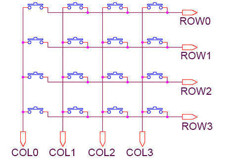
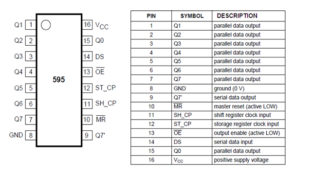
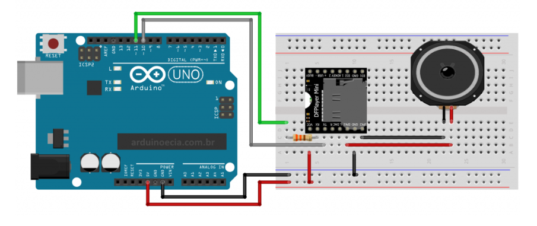

## Components

| Component  | Ammount  |
|-----|-----|
|  Arduino Mega 2560 |  1x  |
| Button | 118x |
| MP3 - DFPlayer module | 1x |
| Speaker | 1x |
| Perfboard | 10x |
| Display 128x128 | 1x |
| CI  74HC595 | 4x |

---
## Assembly

### Buttons schema

the buttons have to be connected like a matrix keyboard, to connect the buttons we need use the perfboard in the form of a periodic table, setting the position of anyone in the place of a element in the table.
 
 
 

### Shift Register schema

the jumpers that come from the buttons, need to be connected in a shift register, because they are to many to be connect directly in the arduino board. 
> To connect the buttons you can follow this diagram

 

 

### MP3 - DFPlayer module
to reproduce the sound on the buttons push, we need to config this module correctly, to connect that in the arduino board, follow the diagram
 

 

### Display

section to do